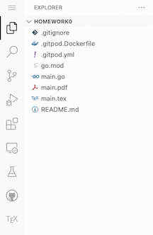
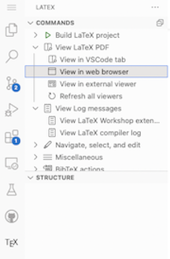
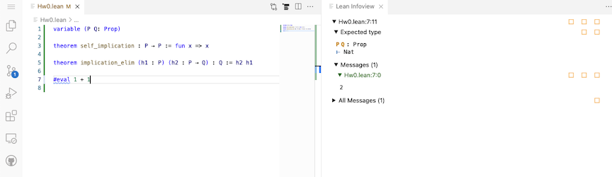

## Homework 0: Due 2022.08.26 

Welcome to the Fall 2022 Math 300 -- Transitions to Advanced Mathematics. This assignment is intended to 
familiarize you with tools used in this course.

- If you don't have an account at GitHub, sign up at [https://github.com/join](https://github.com/join).
If you sign up for a [student developer pack](https://education.github.com/benefits?type=student)
you get additional benefits.
- If you don't have an account at GitPod, sign up at [https://gitpod.io/login/](https://gitpod.io/login/).
Note you can use your GitHub account for authentication. 
- Send me your GitHub username. 
- Open https://gitpod.io/#https://github.com/UofSC-Fall-2022-Math-300-H01/homework0
or click on the GitPod icon above. 
- Open `main.tex` in the side bar. 

  

- Click on the TeX icon > View Latex PDF > View in web browser and then click through the popup. This 
will open up the pdf in a separate tab/window. 

  

- Try to edit `main.tex`, save your edits, and refresh the tab with the viewer to see the changes.
- Close the `main.tex` tab and the separate pdf viewer and open `Hw0.lean`. 
- Put your cursor at the end of  `#eval 1 + 1`. It should look like 

  

- When you are satisfied, stop your workspace. Hit `F1` and select `Gitpod: Stop Workspace`. If 
you don't see it in the search bar that pops up, start typing it and it show up. 

Note that only thing I expect to receive from you is your GitHub username and any complaints :)
